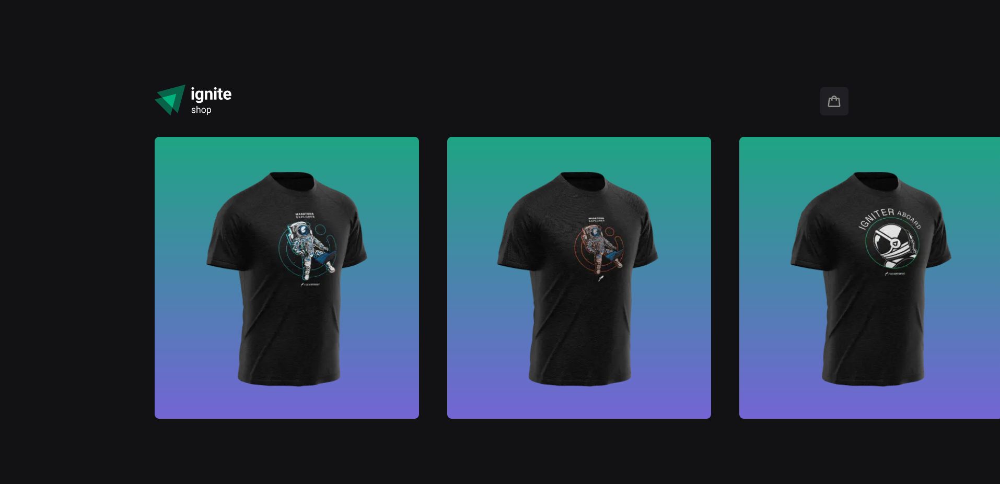
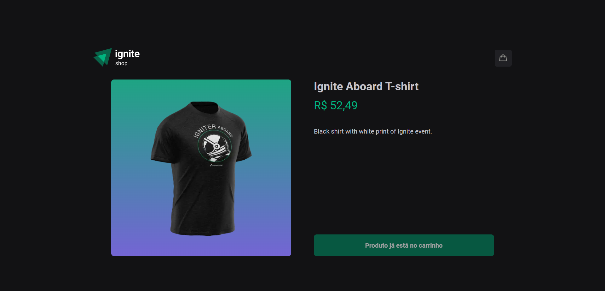
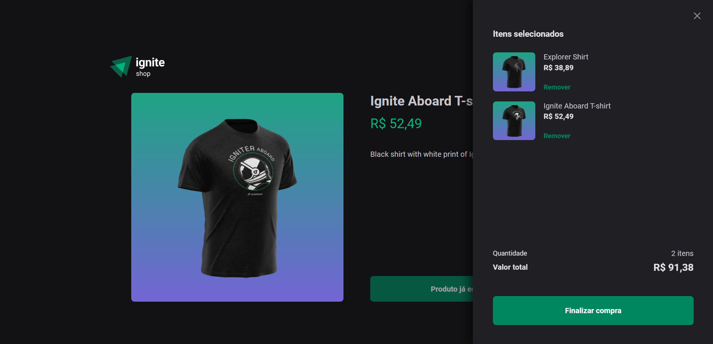

<h1>Ignite Shop</h1>

## About:
Front-end web app of an e-commerce built with NextJS and Tailwind, consuming API with registered data in the Stripe platform, integrated with check-out feature.<br>

### Homepage:


### Item details:


### Cart modal:


## Main tools:

- [NextJS](https://nextjs.org/) ```(v13)```;
- [Typescript](https://www.typescriptlang.org/docs/) ```(v4.6)```;
- [Axios](https://axios-http.com/) ```(v1.2)```;
- [Stripe](https://stripe.com/) ```(v11.6)```;

## User actions:
- Can see a list of products;
- Can see more details about each item, as price and description;
- Can add a product to the cart by the homepage;
- Can add a product to the cart by the details page;
- Can see a list of products already in the cart;
- Can complete the payment through Stripe's API;

## Package manager:
- [npm](https://www.npmjs.com/) ```(v9.5)```;

## Running locally:

> Before installing the project, certificates that you have [Node](https://nodejs.org/en) and [GIT](https://git-scm.com/) installed in your PC.

1. Open your teminal.

2. Execute the following command:

```shell
# clone the repository:
git clone git@github.com:celiovjunior/ignite-shop.git

# go to the project directory:
cd ignite-shop

# install necessary dependencies:
npm install

# open the project folder:
explorer.exe .
```

3. Copy and paste the ```.env.sample``` file in the same directory;

4. Rename the new file with just ```.env```;

5. Paste your Stripe's credential, like the example below:

```bash
# Stripe's credential
NEXT_PUBLIC_STRIPE_SECRET_KEY=

# Localhost url
http://localhost:3000

# Stripe's credentials
NEXT_PUBLIC_STRIPE_SECRET_KEY=

# Local running URL
NEXT_URL=
```

6. Save the file;

7. Run the following command:

```shell
npm run dev
```

Web application will run at http://localhost:3000
